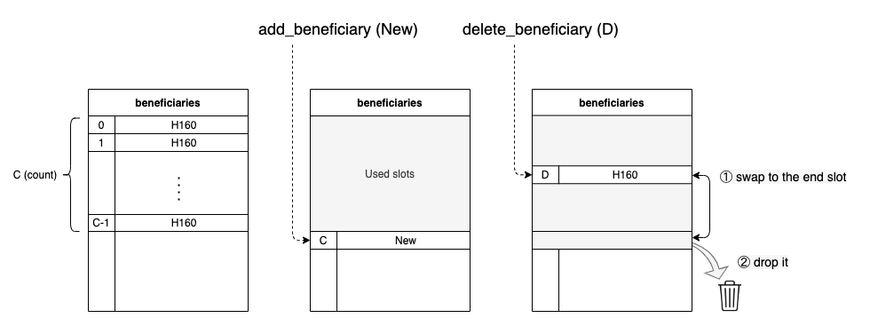

# License Fee

Currently we charge the gas-fee as our license-fee when user executes evm/ssvm action, but when the system has no any beneficiary we still burn it.

## Sudo Permission
We need root permission to update the beneficiaries. Here we use `pallet-sudo` to help us get root permission. Below figure shows us how the  evm's extrinsics add and delete beneficiary is work.

You could also set up default beneficiaries by customizing chain spec ([Create a Custom Chain Spec](https://substrate.dev/docs/en/tutorials/start-a-private-network/customspec)).
