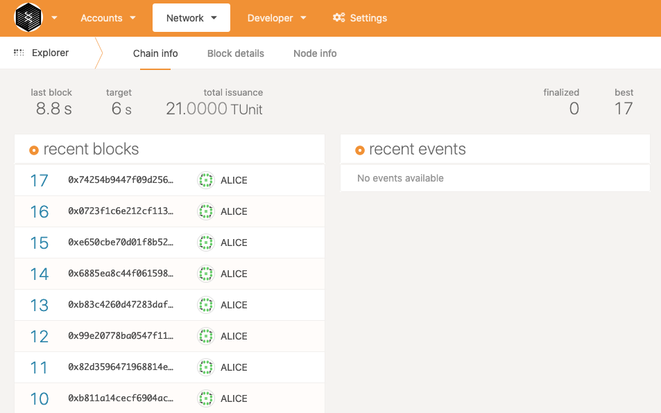
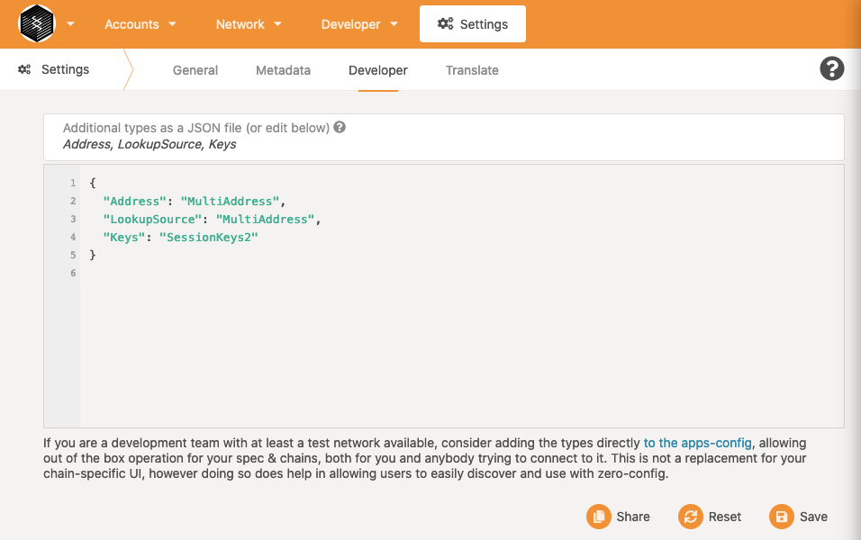
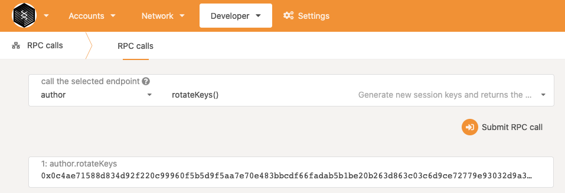
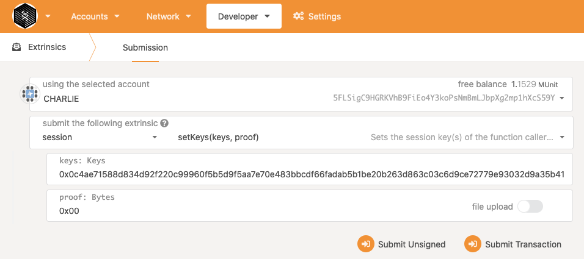
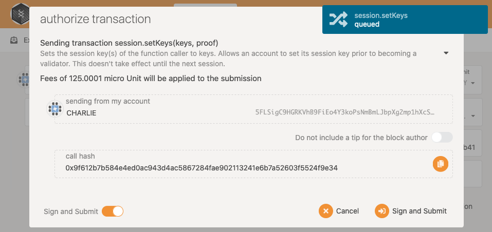
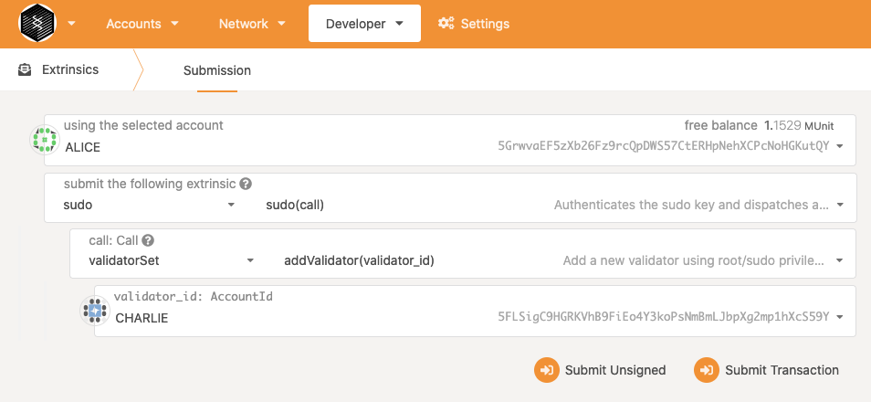
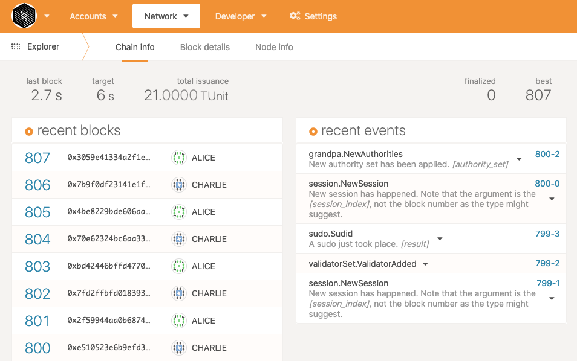
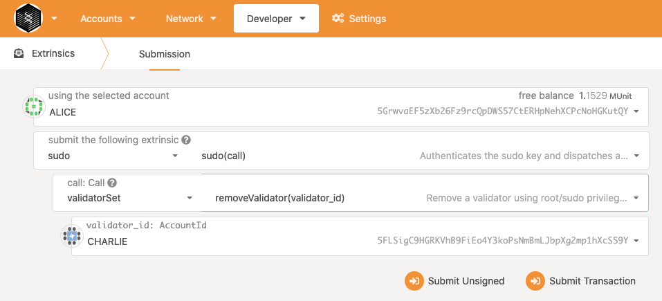
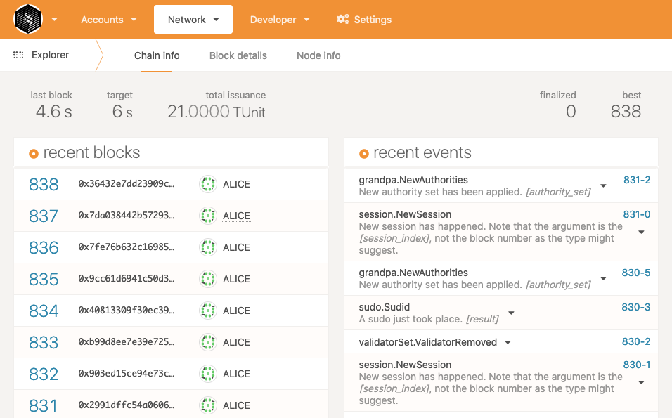

# How to Add / Remove Validators

In this document, we'll setup a simple local chain with a validator node (Alice), and then add/remove another node (Charlie) to its validator set.

## Build

```
git clone https://github.com/ParaState/frontier.git -b ssvm
cd frontier
cargo build --release
```

## Run Node (Alice)

```
cargo run --release \
  --bin frontier-template-node \
  -- \
  --alice \
  --tmp \
  --chain local \
  --validator \
  --execution=Native \
  --unsafe-ws-external
```

## Run Node (Charlie)

When running new node, we need flag `--rpc-methods Unsafe` to get rotate keys from rpc endpoint. After getting the keys, you could restart the node in more safe mode.

```
cargo run --release \
  --bin frontier-template-node \
  -- \
  --charlie \
  --tmp \
  --chain local \
  --validator \
  --execution=Native \
  --unsafe-ws-external \
  --rpc-methods Unsafe \
  --port 30334 \
  --rpc-port 9955 \
  --ws-port 9966
```

## Check Explorer

Open polkadot.js explorer with Alice's websocket endpoint (`ws://localhost:9944`) using this link: https://polkadot.js.org/apps/?rpc=ws%3A%2F%2Flocalhost%3A9944#/explorer

You could see there is only one validator node Alice producing blocks:



Go to `Settings -> Developer`, add the following additional types:

```
{
  "Address": "MultiAddress",
  "LookupSource": "MultiAddress",
  "Keys": "SessionKeys2"
}
```

After adding types, it will look like:



## Set Keys for New Node (Charlie)

Now, connect polkadot.js explorer to Charlie's websocket endpoint (`ws://localhost:9966`) using this link: https://polkadot.js.org/apps/?rpc=ws%3A%2F%2Flocalhost%3A9966#/explorer

Go to `Developer -> RPC Calls` and select `author`, `rotateKeys()`, then submit:



Copy the hex value result. Go to `Developer -> Extrinsics` and select `Charlie`, `session`, `setKeys(keys, proof)`. Paste copied hex value (rotate keys) to `keys` field and set `0x00` to `proof` field:



Click submit and then sign submit:



## Sudo Permission

In `pallet-validator-set`, we need root permission to modify validator list. Here we use `pallet-sudo` to help us get root permission.
At our local chain, root key is set to Alice's account by default. You could modify root key of `pallet-sudo` by customizing chain spec ([Create a Custom Chain Spec](https://substrate.dev/docs/en/tutorials/start-a-private-network/customspec)).

## Add Validator

Go back to Alice's explorer. In `Developer -> Extrinsics`, select `Alice`, `sudo`, `sudo(call)`, `validatorSet`, `addValidator(validator_id)`, `Charlie`:



Click submit and then sign submit. After that, you could see now `Charlie` is producing blocks:



## Remove Validator

Go to Alice's explorer. In `Developer -> Extrinsics`, select `Alice`, `sudo`, `sudo(call)`, `validatorSet`, `removeValidator(validator_id)`, `Charlie`:



Click submit and then sign submit. After that, you cloud see now `Charlie` is removing from validator set:


